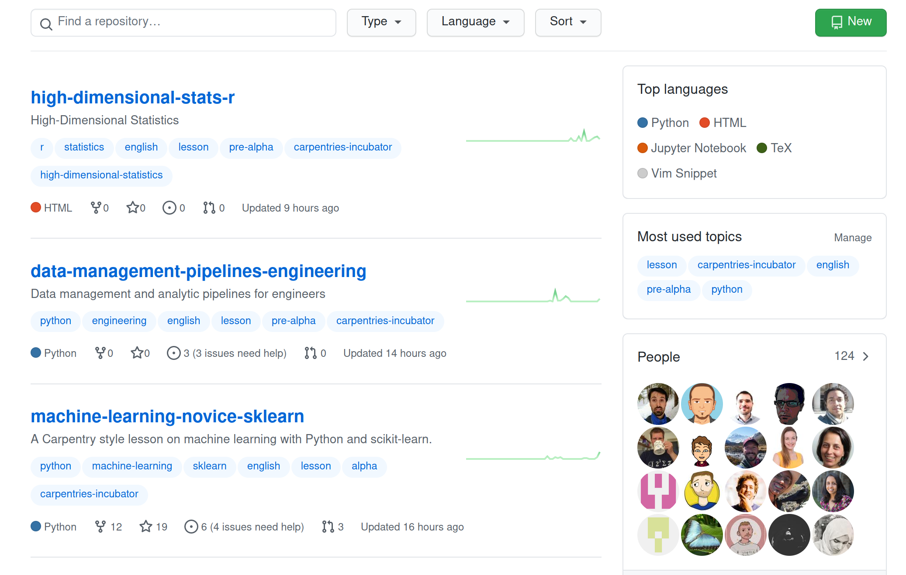

  

    

      

        
      

      

        <h2 class="display-5 fw-bold lh-1 mb-3">About The Carpentries Incubator</h2>
        
The Carpentries Incubator is a place for collaborative development of new lessons. It provides a space for our community to create, test, and improve lessons, supported by systems, process, and training to foster collaboration and promote better lesson design.

      

    

  

  

    <h2 class="display-5 fw-bold lh-1 mb-3">How to get involved</h2>
    

      

        <h2>Write</h2>
        
Share an existing lesson, or propose a brand new one. We will help you get set up so that you can focus on developing your lesson and finding collaborators.

        <a href="https://github.com/carpentries-incubator/proposals/issues/new?assignees=&labels=&template=issue_proposal.md" class="btn btn-primary">
            Propose a new lesson
          </a>
      

      

        <h2>Contribute</h2>
        
In The Carpentries Incubator, lesson development is a community effort. Work together with other community members to finish an existing lesson.

        <a href="https://github.com/carpentries-incubator/" class="btn btn-primary">
            Browse lesson repositories
          </a>
      

      

        <h2>Teach</h2>
        
Many lessons in The Carpentries Incubator are ready to be tested in a workshop. Teach lessons in alpha or beta, and provide feedback.

        <a href="https://carpentries.org/community-lessons/" class="btn btn-primary">
            Filter the lesson listing
          </a>
      

      

        <h2>Review</h2>
        
Lessons that have been completed and tested can be reviewed for acceptance to The Carpentries Lab. Improve a lesson by participating in open peer review.

        <a href="https://github.com/carpentries-lab/reviews/" class="btn btn-primary">
            Review a lesson
          </a>
      

    

  







  <h2 class="display-5 fw-bold lh-1 mb-3">Supporters</h2>
  

    The Carpentries Incubator project is generously supported by <a href="https://chanzuckerberg.com/">The Chan Zuckerberg Initiative</a> and <a href="https://www.moore.org/">The Gordon and Betty Moore Foundation</a>.
  

