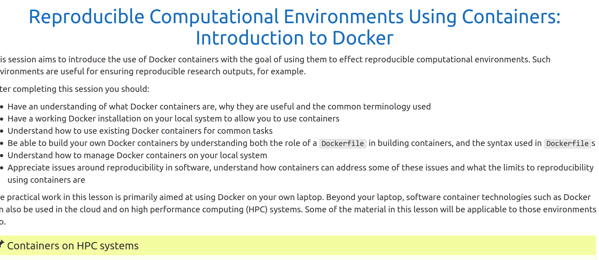
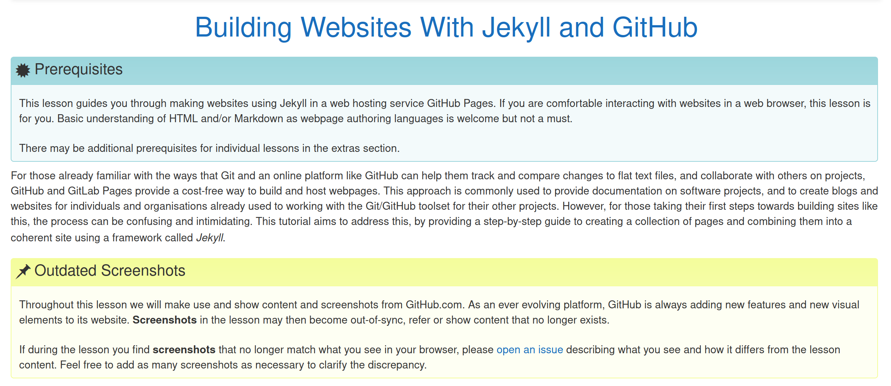

<!doctype html>
<html lang="en">
  <head>
    <!-- Required meta tags -->
    <meta charset="utf-8">
    <meta name="viewport" content="width=device-width, initial-scale=1">

    <!-- Bootstrap CSS -->
    <link href="https://cdn.jsdelivr.net/npm/bootstrap@5.0.2/dist/css/bootstrap.min.css" rel="stylesheet" integrity="sha384-EVSTQN3/azprG1Anm3QDgpJLIm9Nao0Yz1ztcQTwFspd3yD65VohhpuuCOmLASjC" crossorigin="anonymous">

    <title>The Carpentries Incubator</title>
    <link rel="stylesheet" type="text/css" href="assets/css/custom.css"></style>
  </head>
  <body>

    

        
        <h1 class="display-5 fw-bold">The Carpentries Incubator</h1>
        

          
The Carpentries Incubator is repository for collaborative, community-led, lesson development using the pedagogical approach of The Carpentries. From analysis of time series to your first scripts in Julia, find a lesson to learn from or contribute your expertise.

          

            <button type="button" class="btn btn-primary btn-lg px-4 gap-3">Submit a lesson proposal</button>
            <button type="button" class="btn btn-outline-secondary btn-lg px-4">Browse existing lessons</button>
          

        

      

    

  

    

      

        
      

      

        <h2 class="display-5 fw-bold lh-1 mb-3">About The Carpentries Incubator</h2>
        
Lorem ipsum dolor sit amet consectetur adipisicing elit. Ullam deleniti atque, optio nam iure officia repellat placeat numquam facere exercitationem quae architecto? Debitis consectetur ad mollitia, nesciunt aspernatur itaque dolorum.

      

    

  

  

    <h2 class="display-5 fw-bold lh-1 mb-3">How to get get involved?</h2>
    

      

        <h2>Write a lesson</h2>
        
Paragraph of text beneath the heading to explain the heading. We'll add onto it with another sentence and probably just keep going until we run out of words.

        <a href="#" class="btn btn-primary">
            Primary button
          </a>
      

      

        <h2>Contribute to a lesson</h2>
        
Paragraph of text beneath the heading to explain the heading. We'll add onto it with another sentence and probably just keep going until we run out of words.

        <a href="#" class="btn btn-primary">
            Primary button
          </a>
      

      

        <h2>Teach a lesson</h2>
        
Paragraph of text beneath the heading to explain the heading. We'll add onto it with another sentence and probably just keep going until we run out of words.

        <a href="#" class="btn btn-primary">
            Primary button
          </a>
      

      

        <h2>Review a lesson</h2>
        
Paragraph of text beneath the heading to explain the heading. We'll add onto it with another sentence and probably just keep going until we run out of words.

        <a href="#" class="btn btn-primary">
            Primary button
          </a>
      

    

  

  

    <h2 class="display-5 fw-bold lh-1 mb-3">Stats</h2>
    

      
Pre-alpha

      
Alpha

      
Beta

      
Stable

    

    
There are currently:

    <ul>
      <li>65 lessons in pre-alpha</li>
      <li>20 lessons in alpha</li>
      <li>10 lessons in alpha</li>
      <li>5 lessons in alpha</li>
    </ul>
    
Over the last month, 3 lessons have been submitted to the Incubator.

    
25 lessons are currently looking for help.

  

    

        <button type="button" data-bs-target="#carouselExampleCaptions" data-bs-slide-to="0" class="active"
            aria-current="true" aria-label="Slide 1"></button>
        <button type="button" data-bs-target="#carouselExampleCaptions" data-bs-slide-to="1"
            aria-label="Slide 2"></button>
        <button type="button" data-bs-target="#carouselExampleCaptions" data-bs-slide-to="2"
            aria-label="Slide 3"></button>
    

    

        <h2 class="display-5 fw-bold lh-1 mb-3">Featured Lessons</h2>
        

            

                
                

                    <h5>Learn how to use Docker</h5>
                    
Reproducible Computational Environments using Containers.

                

            

            

                
                

                    <h5>Learn how to build websites with Jekyll</h5>
                    
Building Websites with Jekyll & GitHub Pages.

                

            

            

                
                

                    <h5>Metagenomics</h5>
                    
What is in your sample?

                

            

        

        <button class="carousel-control-prev" type="button" data-bs-target="#carouselExampleCaptions"
            data-bs-slide="prev">
            
            Previous
        </button>
        <button class="carousel-control-next" type="button" data-bs-target="#carouselExampleCaptions"
            data-bs-slide="next">
            
            Next
        </button>
    

  

    <h2 class="display-5 fw-bold lh-1 mb-3">Upcoming Workshops teaching Carpentries Incubator Material</h2>
    <table class="table table-striped">
      <thead>
        <tr>
          <th scope="col">Country</th>
          <th scope="col">Dates</th>
          <th scope="col">Lessons</th>
          <th scope="col">Workshop Website</th>
        </tr>
      </thead>
      <tbody>
        <tr>
          <th scope="row">EE</th>
          <td>2021-08-11</td>
          <td>Biostats</td>
          <td><a href="#">https://workshop</a></td>
        </tr>
        <tr>
          <th scope="row">EE</th>
          <td>2021-08-22</td>
          <td>Topic</td>
          <td><a href="#">https://workshop</a></td>
        </tr>
        <tr>
          <th scope="row">EE</th>
          <td>2021-09-05</td>
          <td>Biostats</td>
          <td><a href="#">https://workshop</a></td>
        </tr>
      </tbody>
    </table>
  

  <footer class="footer mt-auto py-3 bg-light">
    

      The Carpentries Incubator is a project of The Carpentries.
      License
      GitHub
    

  </footer>
  
  
    

  </body>
</html>
